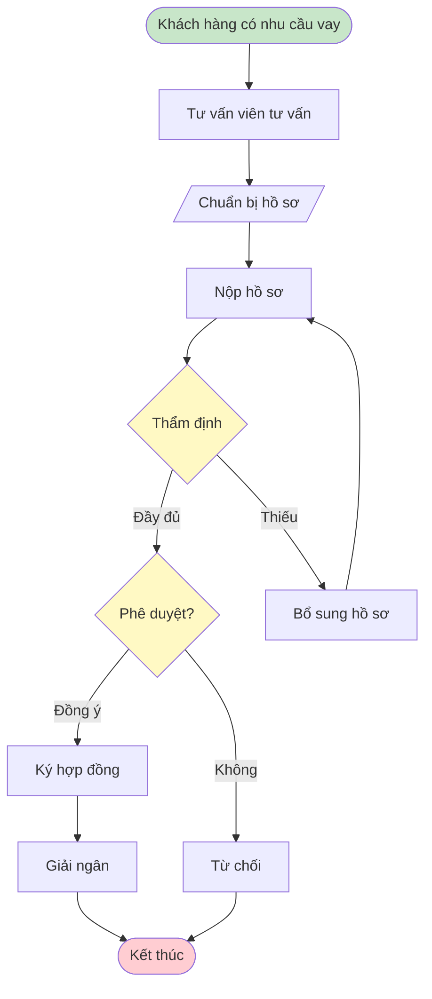

```mermaid
flowchart TD
 Start([Khách hàng có nhu cầu vay])

 Consult[Tư vấn viên tư vấn]
 Docs[/Chuẩn bị hồ sơ/]
 Submit[Nộp hồ sơ]

 Review{Thẩm định}
 Approve{Phê duyệt?}

 Sign[Ký hợp đồng]
 Disburse[Giải ngân]

 Reject[Từ chối]
 Supplement[Bổ sung hồ sơ]

 End([Kết thúc])

 Start --> Consult
 Consult --> Docs
 Docs --> Submit
 Submit --> Review

 Review -->|Đầy đủ| Approve
 Review -->|Thiếu| Supplement
 Supplement --> Submit

 Approve -->|Đồng ý| Sign
 Approve -->|Không| Reject

 Sign --> Disburse
 Disburse --> End
 Reject --> End

 style Start fill:#c8e6c9
 style End fill:#ffcdd2
 style Approve fill:#fff9c4
 style Review fill:#fff9c4
```
